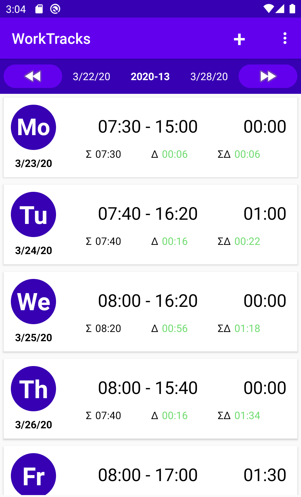
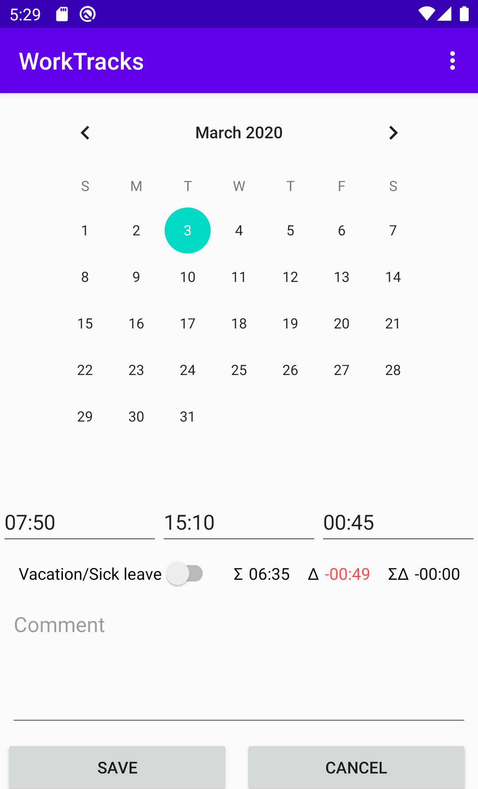
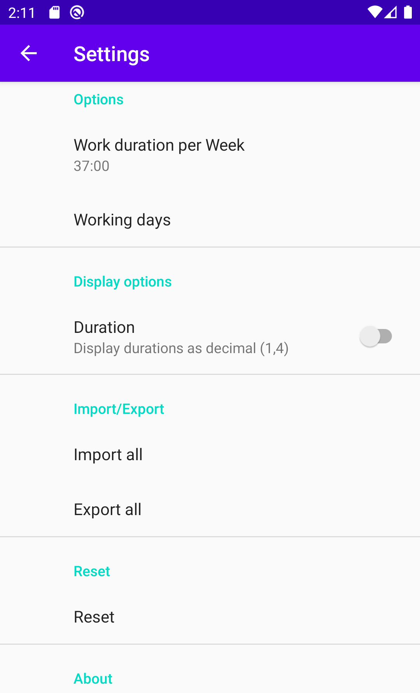

# WorkTracks

WorkTacks is a simple app to track the time when you've been working.

## Features

* __Tracking__: track the time you have worked
* __Statistics__:
  * Shows the total you worked on a day
  * Shows the difference to the time you should have worked
  * Shows the difference to the time you should have worked, accumulated for each week until this day
* __Import/Export__: You can import and export your data as a CSV file.
* __Privacy__:
  * does not contain any in-app analytics
  * does not have Google Play Services (I think)
  * has no cloud integration

## Screenshots

    
        
    

## Building

This app uses the Gradle build system. To build this project, use the "gradlew build" command or use "Import Project" in Android Studio.

## Planned features

- [X] remove destructive migration to prevent possible data loss
- [X] create real and signed release
- [X] add work time per week parameter
- [X] remove unused settings
- [X] design icon (used icon from internet)
- [X] move add button to top bar so it does not overlap other information
- [X] do not allow empty input when saving
- [ ] swipe left/right for new week
- [ ] edit/delete workday by clicking
- [ ] enable preview of work time for entire week in add or edit fragment
